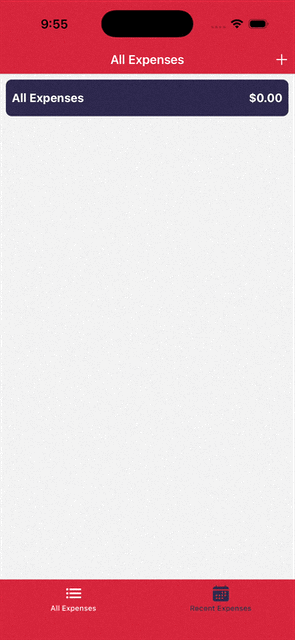

# Expense Tracker App

A simple Expo React Native app for tracking expenses and viewing spending summaries by time period.

## Features

- **All Expenses** — view all expenses with a running total.
- **Recent Expenses** — track expenses from the last 7 days.
- **Add Expense** — create new expenses with title, amount (up to 2 decimal places), and date.
- **Confirmation Modal** — confirm deletion or critical actions with custom prompts.

## How to Run
1. Ensure you have Expo CLI installed (`npm install -g @expo/cli`).
2. Navigate to the project root.
3. Install dependencies with `npm install`.
4. Start the app with `expo start`.
5. Scan the QR code with Expo Go on your device or run in an emulator.

## Credits
Built as part of the [React Native - The Practical Guide](https://www.udemy.com/course/react-native-the-practical-guide/) course on Udemy.